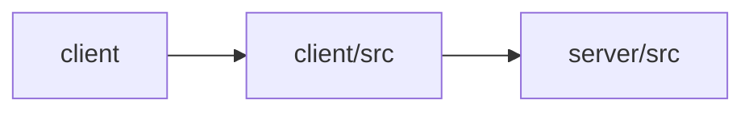

# Architecture

Otto Content Studio is a full-stack, multi-workflow AI application. The React client (client, client/src) provides a unified Studio workspace exposing five content workflows—blog writing, chat, summarization, translation, and caption generation—each isolated into a feature folder pairing a UI component with a custom hook. Hooks call the backend through a shared HTTP utility (client/src/lib/api.ts). The Express server (server/src) exposes matching REST endpoints (/api/blog/generate, /api/summarize, /api/translate, /api/caption, /api/agent), all guarded by an x-api-key auth middleware and a global error handler, and backed by Anthropic Claude models via an SDK client wrapper and versioned system prompts. Vite proxies API calls from the client to the server during development.

## Modules

| module | summary | AI |
| --- | --- | --- |
| `client` | Vite build and dev configuration with React plugin and backend API proxy. | — |
| `client/src` | React frontend housing the Studio workspace and five AI content workflows, each a feature folder with a component plus hook. | — |
| `server/src` | Express REST API exposing AI content endpoints backed by Anthropic Claude with auth and error-handling middleware. | [AI] |

## Module dependencies

_`[AI]` marks modules with AI/LLM touchpoints (prompt files, model API calls, agent logic)._
