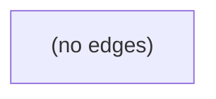

# Architecture

This codebase has 3 module(s). Summary synthesized offline (stub).

## Modules

| module | summary | AI |
| --- | --- | --- |
| `client` | The client module — 1 file(s), 0 public export(s). | — |
| `client/src` | The client/src module — 27 file(s), 8 public export(s). | — |
| `server/src` | The server/src module — 13 file(s), 3 public export(s). | [AI] |

## Module dependencies

_`[AI]` marks modules with AI/LLM touchpoints (prompt files, model API calls, agent logic)._
