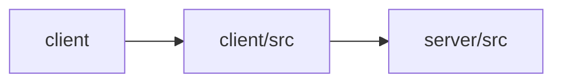

# Architecture

Otto is an AI content studio composed of a React (Vite) frontend and an Express.js REST API backend powered by Anthropic Claude models. The client offers five workflows—blog writing, chat, summarization, translation, and caption generation—each organized as a self-contained feature folder pairing a presentational component with a dedicated hook that calls the backend. The server exposes matching REST endpoints (/api/blog, /api/summarize, /api/translate, /api/caption, /api/agent), each backed by a Claude call with a purpose-specific system prompt, guarded by x-api-key authentication and a global error handler. The Vite dev server proxies /api requests to the backend on localhost:4000. AI touchpoints are concentrated in the feature hooks on the client and the route handlers plus prompt definitions on the server.

## Modules

| module | summary | AI |
| --- | --- | --- |
| `client` | Vite build configuration for the React frontend with an /api proxy to localhost:4000. | — |
| `client/src` | React application shell routing between Landing and a multi-tab Studio, with feature folders per AI workflow. | — |
| `server/src` | Express REST API exposing Claude-backed content operations with API-key auth and streaming support. | [AI] |

## Module dependencies

_`[AI]` marks modules with AI/LLM touchpoints (prompt files, model API calls, agent logic)._
