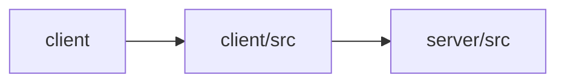

# Architecture

Otto is a multi-workflow AI content studio composed of three modules: a Vite/React client build configuration (client), a React frontend (client/src), and an Express backend (server/src). The frontend presents a tab-based Studio shell for five content workflows—blog writing, chat/agent, summarization, translation, and image captioning. Each workflow is organized as a feature folder with a presentational component and a dedicated hook that calls a corresponding backend endpoint through a shared HTTP client (lib/api.ts). The Express server exposes REST endpoints per workflow, authenticates via API key middleware, and delegates AI operations to Anthropic (via @anthropic-ai/sdk and the ai SDK), with system prompts centralized under lib/prompts. The Vite dev server proxies /api requests to the backend. AI touchpoints are concentrated in feature hooks on the client and in route handlers plus prompt definitions on the server.

## Modules

| module | summary | AI |
| --- | --- | --- |
| `client` | Vite build and dev-server configuration with an /api proxy for the React client. | — |
| `client/src` | React frontend organized into feature folders (blog, chat, summarizer, translator, captions) with shared UI and layout components. | — |
| `server/src` | Express REST API providing AI content operations backed by Anthropic, with API key auth and centralized prompts. | [AI] |

## Module dependencies

_`[AI]` marks modules with AI/LLM touchpoints (prompt files, model API calls, agent logic)._
